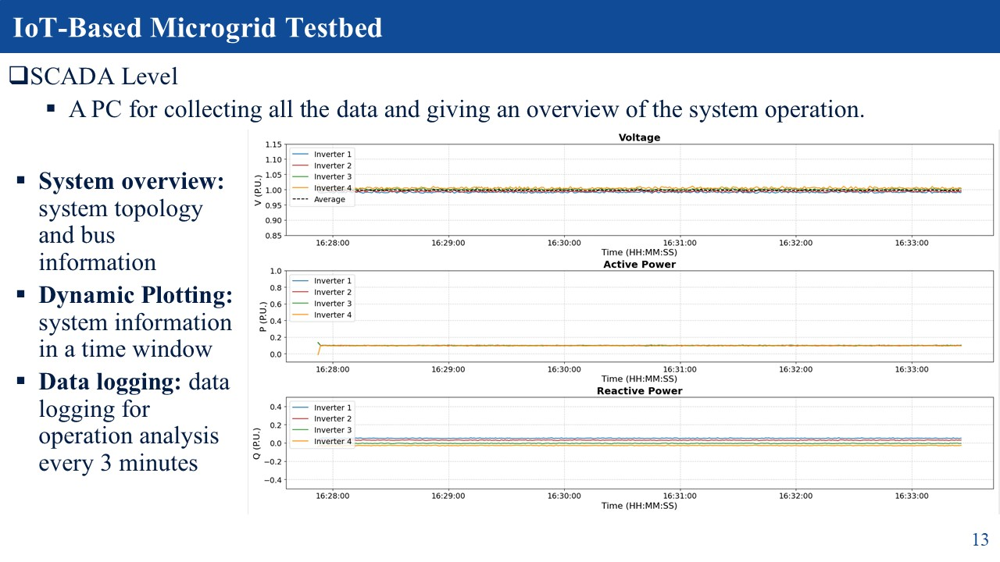
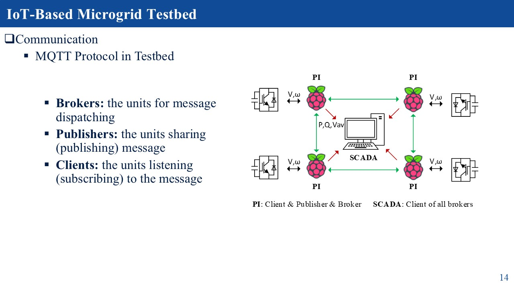
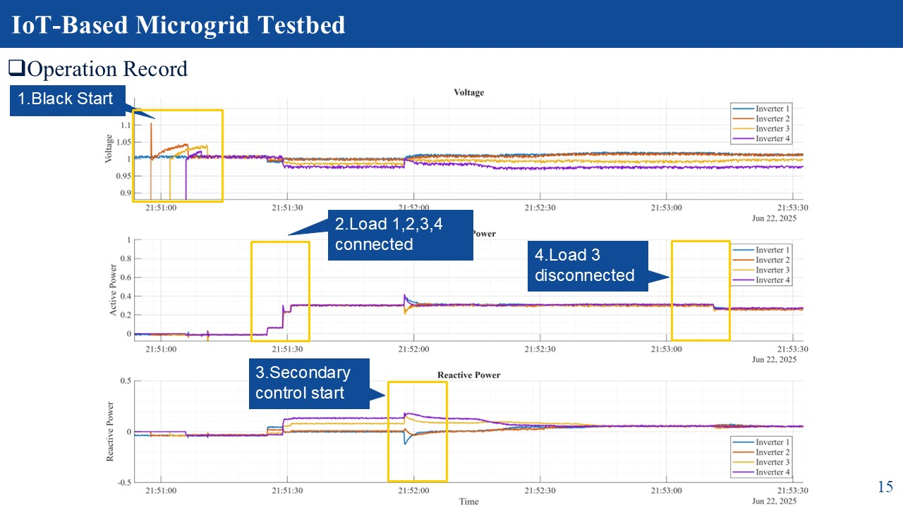

# IoT-Based Microgrid Hardware Testbed
**Author:** Jun Zhang   
**Update:**  
- June 2025 — First upload   

---

### Main Features
1. **IoT-based:** A microgrid testbed utilizing the Internet-of-Things (IoT) protocol (MQTT), well-suited for distributed systems.  
2. **Authenticity:** All components are real hardware.  
3. **Transparency:** No simulators are involved; the entire system is fully observable.  
4. **Cost-efficiency:** The overall system cost is approximately **1/40** of a typical HIL system.  
5. **Safety:** Operating at **12V** eliminates major concerns regarding electrical isolation.  
6. **Easy Observation and Control:** The developed UI and SCADA system facilitate system-wide monitoring and control.  

---

## System Structure

---

## Software Versions

| Software         | Version                                   |
|------------------|-------------------------------------------|
| **MATLAB**       | 2020b                                    |
| **CCS**          | V12.7.1.00001 (TI Compiler v22.6.1.LTS) |
| **Ubuntu**       | 22.04 LTS                                |
| **Python**       | 3.11                                     |
| **PyQt6, PySide6** | 6.7.2                                 |
| **Paho-MQTT**    | 2.1.0                                   |
| **PySerial**     | 3.5                                     |
| **Mosquitto**    | 2.0.20                                  |

---

## Required Hardware

- **Raspberry Pi:** 4 × Raspberry Pi 5 (4GB)  
- **DSP Controller:** 4 × LAUNCHXL-F28379D  
- **Router**  
- **Other Components:**  
  - A Windows or Linux PC for SCADA  
  - Resistors, inductors, capacitors for LC filters, feeders, and loads  
  - Relay blocks and circuit breakers for load switching  
  - Banana cables, meters, oscilloscope, etc.  

---

## System Parameters

### Inverter and DC Bus

| Source   | Inverter Capacity | DC Bus Voltage | LC Filter Parameters |
|----------|------------------|----------------|----------------------|
| **DG 1** | 100 VA            | 45 V           | 0.56 mH, 22 μF       |
| **DG 2** | 100 VA            | 45 V           | 0.56 mH, 22 μF       |
| **DG 3** | 100 VA            | 45 V           | 0.56 mH, 22 μF       |
| **DG 4** | 100 VA            | 45 V           | 0.56 mH, 22 μF       |

### Loads

| Load            | Total Resistance (R + DCR) | Inductance  | Inductor DCR |
|-----------------|----------------------------|--------------|---------------|
| **Load 1 (Z1)**   | 10.08 Ω                 | 6.25 mH ±1% | 2.08 Ω       |
| **Load 2 (Z2)**   | 28.34 Ω                 | 8.00 mH ±1% | 3.34 Ω       |
| **Load 3 (Z3)**   | 25.56 Ω                 | 1.80 mH ±1% | 0.85 Ω       |
| **Load 4 (Z4.1)** | 10.08 Ω                 | 6.25 mH ±1% | 2.08 Ω       |
| **Load 4 (Z4.2)** | Adjustable: 10 Ω        | —            | —            |

### Feeders

| Feeder          | Total Resistance (R + DCR) | Inductance  | Inductor DCR |
|-----------------|----------------------------|--------------|---------------|
| **Feeder (Z12)** | 0.13 Ω (0.10 Ω + DCR)   | 3.3 μH ±15% | 0.03 Ω       |
| **Feeder (Z23)** | 0.13 Ω (0.10 Ω + DCR)   | 3.3 μH ±15% | 0.03 Ω       |
| **Feeder (Z34)** | 0.13 Ω (0.10 Ω + DCR)   | 3.3 μH ±15% | 0.03 Ω       |

---

## Grid Level

  
  

---

## Control Level

  

---

## SCADA System

  

---

## Communication Structure

  

---

## Operation Record

  

---

## Implemented Algorithms

### Primary Control: Droop Control  
[1] N. Pogaku, M. Prodanovic, and T. C. Green, "Modeling, Analysis and Testing of Autonomous Operation of an Inverter-Based Microgrid," *IEEE Transactions on Power Electronics*, vol. 22, no. 2, pp. 613–625, Mar. 2007.

### Secondary Control: Distributed Secondary Control  
[2] V. Nasirian, Q. Shafiee, J. M. Guerrero, F. L. Lewis, and A. Davoudi, "Droop-Free Distributed Control for AC Microgrids," *IEEE Transactions on Power Electronics*, vol. 31, no. 2, pp. 1600–1617, Feb. 2016.

---
