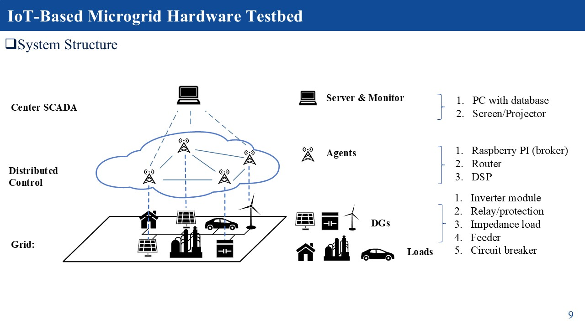
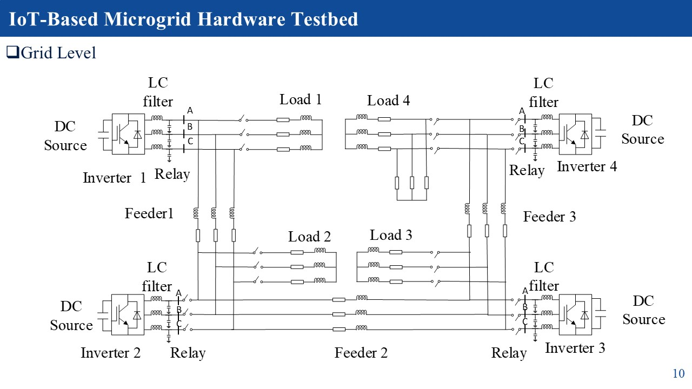
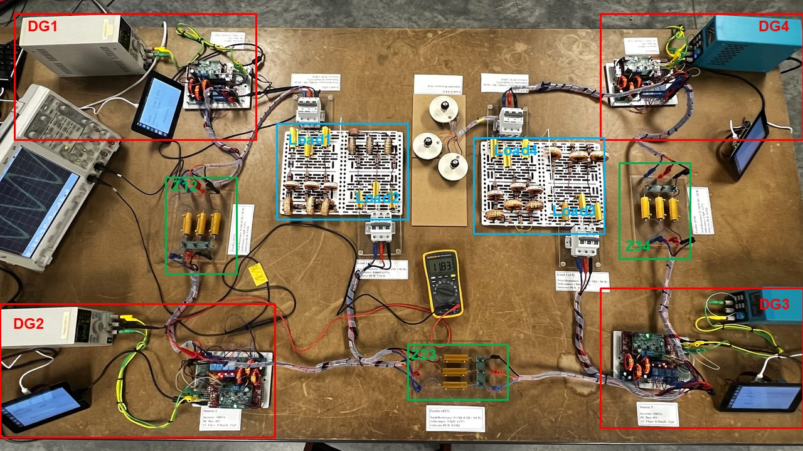
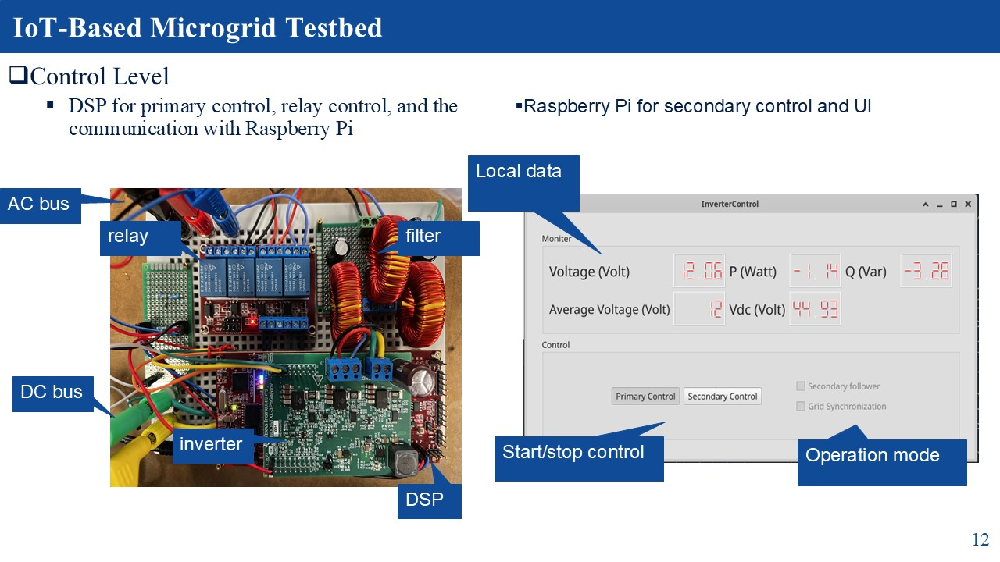

# IoT-Based-Microgrid-Testbed
Main features: 
    1. IoT-based: A Microgrid Testbed based on Internet-of-things protocal (MQTT), which is good for distributed system.
    2. Authenticity: All the components are real hardware.
    3. Transparency：No simulator is involved and everything is visible.
    4. Cost-efficiency: the entire system costs around 1/40 of HIL system.
    5. Safety: Operating at 12V eliminates major concerns regarding electrical isolation.
    6. Easy Observation and control: The developed UI and SCADA system make the system-wide oberservation and control easier.
---

## System structure

--- 

## Software Version

| Software | Version |
|-----------|----------|
| **Matlab** | 2020b |
| **CCS** | V12.7.1.00001 (TI compiler v22.6.1.LTS) |
| **Ubuntu**| 22.04 LTS |
 **python**| 3.11 |
 **PyQt6, PySide6**| 6.7.2 |
  **Paho-mqtt**| 2.1.0|
  **pyserial**| 3.5|
  **mosquitto**| 2.0.20|
  

---

## Required Hardware

- **Raspberry Pi:** 4*Raspberry Pi 5 (4G)
- **DSP controller:** 4*LAUNCHXL-F28379D  
- **Rounter:** 
- **Others:**  
  - A Windos or Linux PC for SCADA 
  - Inductors, Capacitos for LC filter, feeders and loads
  - Relay blocks, circuit breakers for load changes
  - Banana cables,meter, oscilloscope ...

## Grid Level

---

## Control Level

---

    
    
