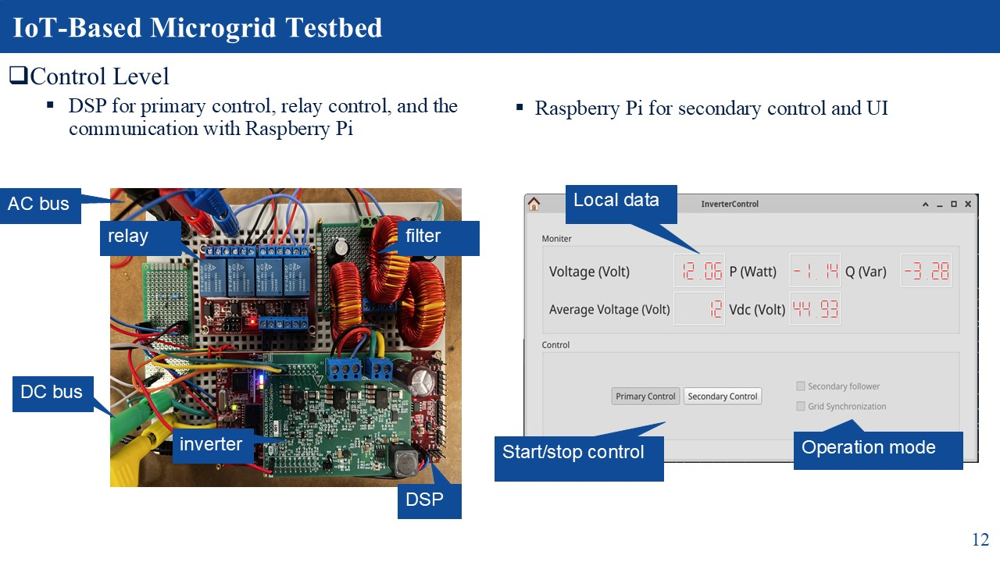

# IoT-Based-Microgrid-Testbed
Main features: 
    1. IoT-based: A Microgrid Testbed based on Internet-of-things protocal (MQTT), which is good for distributed system.
    2. Authenticity: All the components are real hardware.
    3. Transparency：No simulator is involved and everything is visible.
    4. Cost-efficiency: the entire system costs around 1/40 of HIL system.
    5. Safety: Operating at 12V eliminates major concerns regarding electrical isolation.
    6. Easy Observation and control: The developed UI and SCADA system make the system-wide oberservation and control easier.
---

## System structure

--- 

## Grid Level

---

## Control Level

---

    
    
